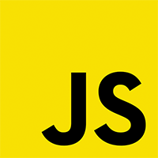

# Javascript Achievements

[Overzicht alle beschikbare opdrachten](https://trello.com/b/xo5TJzFr/javascript-achievements)

- Fork deze repository door op de "Fork" knop rechtsboven te klikken.
- Dit kopieert DEZE voorbeeld repository naar JOUW Github account.
- Clone de repository in JOUW account naar je computer via de command line
- `git clone <de url van JOUW Javascript Achivements repository> Javascript-Achievements`
- Werk in die nieuwe map op je computer aan je Javascript Achievements

In het het bestand  [index.html](index.html) houd je een overzicht bij van wat je hebt gedaan met linkjes naar de opdrachten.
**Dit overzicht zet je op je eigen Ma Cloud website en houd je up-to-date!**

Plaats in deze readme een link naar het index bestand op je ma-cloud site.  
**HIER de link plaatsen**

